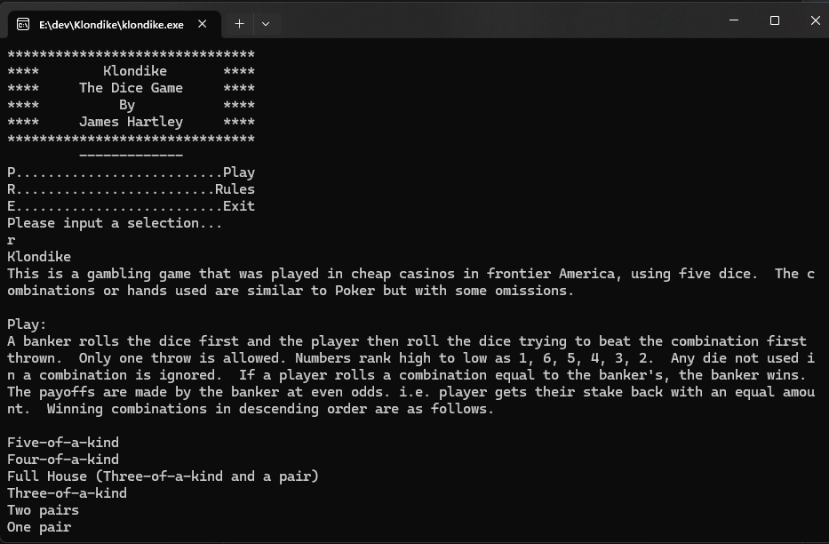

# 🎲 Klondike: The Dice Game

## Description
This is a gambling game that was played in cheap casinos in frontier America, using five dice.  The combinations or hands used are similar to Poker but with some omissions.

This was also my midterm project for my C++ class in college.

## How to Play
A banker rolls the dice first and the player then roll the dice trying to beat the combination first thrown.
  
Only one throw is allowed. Numbers rank high to low as 1, 6, 5, 4, 3, 2.  

Any die not used in a combination is ignored.  If a player rolls a combination equal to the banker's, the banker wins. The payoffs are made by the banker at even odds. i.e. player gets their stake back with an equal amount.  Winning combinations in descending order are as follows.

* `Five-of-a-kind`
* `Four-of-a-kind`
* `Full House (Three-of-a-kind and a pair)`
* `Three-of-a-kind`
* `Two pairs`
* `One pair`

## Code Flow

The code for this project is structured as follows:

* `main.cpp` is the main file that contains the game loop.
* `GetRules()` is the function that retrieves the rules of the game from the rules.dat file.
* `RollDice()` is the function that rolls the dice.
* `CalcHand()` is the function that calculates the hand for a player.
* `PlayGame()` is the function that plays a game of Klondike.

## Dependencies

On windows you can use Netbeans and Cygwin and utilize the included Netbeans project or check the How To Run section below for compiling on with visual studio.

If your on Linux odds are you don't need my help to compile this.

## How to Run

To run this project you can run make on linux or compile on windows using the visual studio command line.

#### Windows (from Visual Studio Command Prompt):

`cl /EHsc main.cpp /link /out:klondike.exe`

Then launch klondike.exe